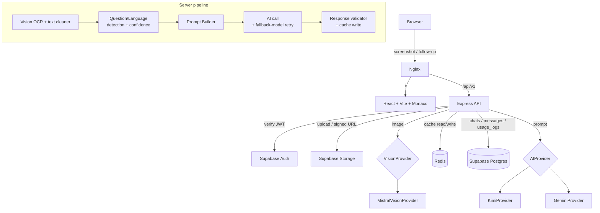

# SolveAI

A ChatGPT-like platform that solves coding and SQL problems straight from a screenshot: upload
(or paste) a LeetCode/Codeforces/HackerRank/GeeksforGeeks-style problem, and get back raw,
runnable code in Monaco — no explanations, no markdown, just the solution.

## Features

- **Screenshot in, code out** — drag-drop or paste (Ctrl+V) a problem screenshot; get back
  clean C, C++, Python, or SQL.
- **Follow-up chat** — the four canned buttons ("Wrong Answer", "TLE", "Runtime Error",
  "Compilation Error") get a specialized re-generation prompt, but you can also type any
  free-form instruction ("make it iterative", "add type hints") and it updates the previous
  solution accordingly — still code-only output, no explanations.
- **Vision-model OCR** — screenshots are transcribed by a dedicated OCR/vision model
  (`mistral-ocr-latest` by default) rather than a classical geometric OCR pipeline, so reading
  order holds up on two-column layouts, dark mode, watermarks, and photographed screens.
- **Multi-screenshot upload** — split a problem across several screenshots (e.g. statement +
  code editor) and they're transcribed together, in upload order.
- **Manual language fallback** — if the extracted text is too ambiguous to confidently tell
  C/C++/Python apart, the app asks the user to pick the language explicitly instead of silently
  guessing wrong.
- **Redis caching at three layers** — OCR results, generated code per question, and follow-up
  responses are all cached, so identical requests never re-hit the OCR engine or the AI
  provider.
- **Swappable AI and vision providers** — `AIProvider` (Kimi / Gemini) and `VisionProvider`
  (Mistral) are each a one-line env var away from being swapped, no code changes.
- **Copy / download code, retry on failure, upload progress** in the UI.

## Architecture



Layered backend: `controller → service → repository → Supabase`, with two parallel provider
abstractions — `providers/ai/` (`AIProvider` → `KimiProvider` / `GeminiProvider`) and
`providers/vision/` (`VisionProvider` → `MistralVisionProvider`) — so business logic never
touches a specific vendor's API shape.

## Repository layout

```
client/          React + Vite + Tailwind + Monaco
server/          Express API (config/, repositories/, services/, providers/, controllers/,
                 routes/, middleware/, validators/, utils/, test/)
nginx/           Reverse proxy config
docker-compose.yml
```

## Setup

### Prerequisites
- Docker + Docker Compose
- A Supabase project (Auth + Postgres + Storage)
- An API key for at least one AI provider: [Moonshot/Kimi](https://platform.moonshot.ai) and/or
  [Gemini](https://aistudio.google.com/apikey)
- A [Mistral](https://console.mistral.ai) API key for OCR

### 1. Database
Run `server/src/config/schema.sql` once in your Supabase project's SQL editor. Creates
`profiles`, `chats`, `messages`, `usage_logs`, RLS policies, the `handle_new_user` trigger, and
the private `screenshots` storage bucket.

### 2. Environment variables
```
cp .env.example .env
cp server/.env.example server/.env
cp client/.env.example client/.env
```

Key variables in `server/.env`:

| Variable | Purpose |
|---|---|
| `SUPABASE_URL` / `SUPABASE_ANON_KEY` / `SUPABASE_SERVICE_ROLE_KEY` | From Supabase project settings → API |
| `AI_PROVIDER` | `kimi` or `gemini` — picks which provider `providers/ai/index.js` instantiates |
| `KIMI_API_BASE_URL` / `KIMI_API_KEY` / `KIMI_MODEL` | Only required if `AI_PROVIDER=kimi` |
| `GEMINI_API_KEY` / `GEMINI_BASE_URL` / `GEMINI_MODEL` | Only required if `AI_PROVIDER=gemini` |
| `VISION_PROVIDER` | `mistral` (default, only option today) — picks which provider `providers/vision/index.js` instantiates |
| `MISTRAL_API_KEY` | Required for OCR |
| `ALLOWED_ORIGIN` | Comma-separated list of allowed browser origins for CORS |
| `NODE_ENV` | `development` enables the optional dev-mode code syntax checker (see below) |

Root `.env` needs `VITE_SUPABASE_URL` / `VITE_SUPABASE_ANON_KEY` too — docker-compose bakes
those into the client build.

**Adding another provider** (OpenAI, Claude, ...): implement the `AIProvider` (or
`VisionProvider`) interface in a new file under `server/src/providers/ai/` (or `providers/vision/`),
register it in that directory's `index.js` factory map, add its env vars to `config/env.js`. No
controller, service, or prompt-builder changes needed.

### 3. Run
```
docker compose up --build
```
The app is served at `http://localhost`. Compose healthchecks gate startup order — `server`
won't start until `redis` reports healthy.

### Local development (without Docker)
- `server`: `npm install && npm run dev` (API under `/api/v1`)
- `client`: `npm install && npm run dev` (Vite dev server, port 5173)

## Testing

```
cd server
npm test                                    # fast unit tests, no network, no cost
RUN_INTEGRATION_TESTS=true npm test         # + live tests against a running stack
                                             # (real Supabase/Redis/Vision/AI — costs real tokens)
```

Integration tests live in `server/test/integration/` and use fixture screenshots (Python,
C++, C, SQL) checked into `server/test/integration/fixtures/`. They're skipped by default so
`npm test` stays fast, deterministic, and free; opt in explicitly when you want to verify the
real end-to-end flow.

Optional dev-mode code validation (`server/src/services/parser/codeValidator.js`) syntax-checks
freshly generated code via `python3`/`gcc`/`g++` when `NODE_ENV=development` and the relevant
toolchain is on `PATH` — logs a warning on failure, never blocks the response, and is a no-op
in production regardless of what's installed.

## Deployment notes

- All four services (`client`, `server`, `redis`, `nginx`) have Docker healthchecks and
  `mem_limit`/`cpus` caps in `docker-compose.yml`.
- Only `nginx` publishes a port to the host; everything else communicates over the internal
  Compose network.
- `redis-data` is a named volume — don't `docker compose down -v` unless you want to lose the
  cache.
- Logs are structured JSON (Pino) in production, pretty-printed in `NODE_ENV=development`.

## Deploying to Vercel

Docker Compose isn't used for this path — `client/` and `server/` deploy as two separate Vercel
projects instead. `server/src/app.js` exports the Express app with no `.listen()` call (used by
Vercel's Node runtime); `server/src/server.js` (which does call `.listen()`) is only used for
local dev and the Docker path above. Both `client/vercel.json` and `server/vercel.json` are
already checked in.

### 1. Redis
Vercel has no persistent compute/storage, so self-hosted Redis isn't an option. Create a free
database at [Upstash](https://upstash.com) and copy its `rediss://` connection string — no code
changes needed, `ioredis` picks up TLS automatically from the `rediss://` scheme.

### 2. Deploy the server
```
cd server
npx vercel          # first run: links/creates the project, deploys a preview
npx vercel --prod    # promote to production once you're happy with it
```
In the Vercel dashboard for this project, set the same environment variables as
`server/.env.example` (Supabase, `REDIS_URL` from step 1, your AI/vision provider keys), plus
`ALLOWED_ORIGIN` — leave it as `http://localhost,http://localhost:5173` for now, you'll update it
in step 4. Note the deployment URL Vercel gives you (e.g. `solveai-server.vercel.app`).

### 3. Deploy the client
```
cd client
npx vercel
npx vercel --prod
```
Set `VITE_SUPABASE_URL`, `VITE_SUPABASE_ANON_KEY`, and `VITE_API_BASE_URL` (the server URL from
step 2 + `/api/v1`, e.g. `https://solveai-server.vercel.app/api/v1`) as environment variables in
this project — Vite bakes these in at build time, so redeploy after changing any of them.

### 4. Close the loop
Update `ALLOWED_ORIGIN` on the **server** project to the client's URL from step 3 (e.g.
`https://solveai-client.vercel.app`), then redeploy the server (`npx vercel --prod`) so CORS
allows requests from it.

### Notes
- Both projects auto-detect their framework (Express, Vite) with no build-command overrides
  needed.
- The Express app becomes a single Vercel Function; Hobby-tier default/max duration is 300s
  (5 minutes) with Fluid compute, comfortably above this app's observed worst-case AI-provider
  latency (under 3 minutes) — no `maxDuration` override needed unless you change AI providers to
  something slower.
- `express.static()` doesn't work on Vercel, but this app doesn't rely on it — the client is a
  separate project entirely.

## Roadmap / known limitations

- Mistral OCR (default vision provider) doesn't reliably preserve source indentation, and can
  occasionally emit a fabricated closing tag around generic/template syntax (e.g. `vector<int>`
  → a stray `</vector>`-like artifact). `services/parser/ocrCleaner.js` fixes the safe, exact
  case (an adjacent self-closing echo of the same tag) but doesn't attempt to repair
  unrelated/hallucinated tag names, since guessing at the "correct" text would risk silently
  fabricating content — always spot-check extracted numbers/code before treating output as
  ground truth for numeric-heavy content.
- No real per-request API cost tracking yet (`usage_logs.api_cost` isn't populated from actual
  provider pricing).
- No CI pipeline wired to run `npm test` / integration tests automatically on push.
- Frontend progress indicators during a request are staged/simulated (the API is a single
  request/response, not a stream) — accurate but not truly real-time.
